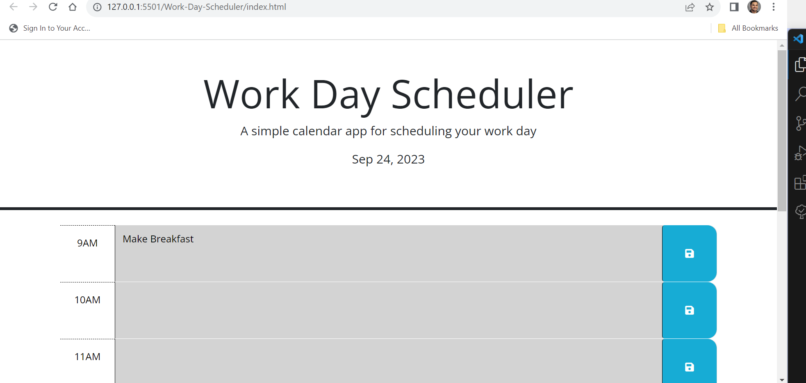
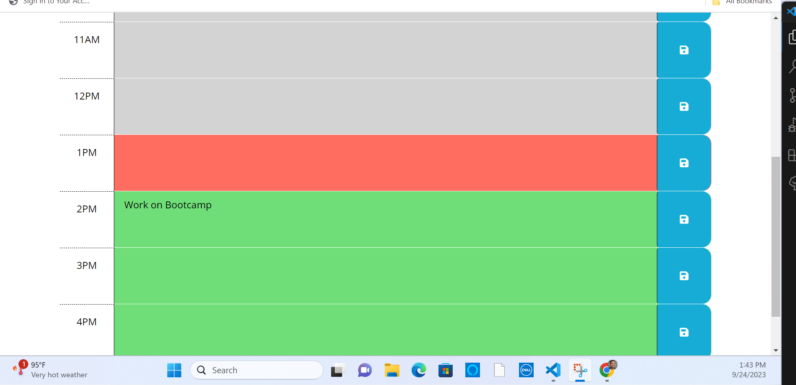
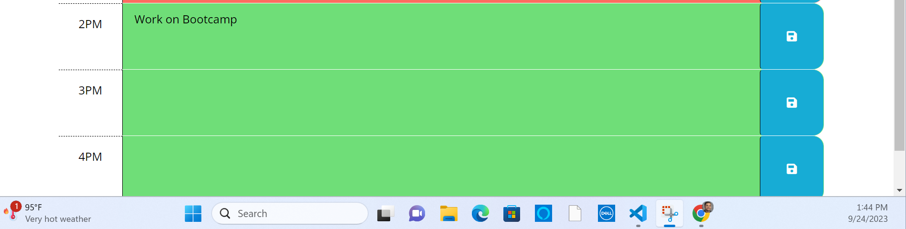

# Work-Day-Scheduler

## Project Description

The Work Day Scheduler is a web-based calendar application that helps you schedule and organize your workday. It allows you to create tasks for different hours of the day, save them, and check the current date and time. The application uses HTML, CSS, JavaScript, and libraries like jQuery and Day.js to provide a user-friendly scheduling experience.

## Table of Contents

- Installation
- Usage
- Credits
- Features

## Installation

To use the Work Day Scheduler, follow these steps:

1. Clone this repository to your local machine using `git clone`.
2. Open the project folder in your code editor.
3. Open the `index.html` file in your web browser.

## Usage

- Create tasks for different hours of your workday.
- Click the "Save" button to save your tasks locally.
- The application will automatically color-code tasks based on their time compared to the current time: past tasks are gray, the present task is red, and future tasks are green.
- You can edit or update tasks at any time.
- The current date is displayed at the top of the page.
- Visual step by step guide: 

## Credits

- jQuery
- Day.js
- Jeremy Henry - Bootcamp Instructor
- w3 Schools 
- stackoverflow.com
- linuxhint.com

## Features

- Create tasks for specific hours.
- Save and retrieve tasks locally.
- Automatic color-coding of tasks based on time.
- Display of the current date.